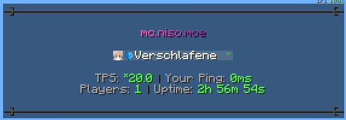

# NisoPlugin

NisoPlugin is a PaperMC plugin for Minecraft 1.21.4 that provides various features to enhance your server experience.

This plugin includes functionalities such as warps and homes stored in a PostgreSQL Database, customizable server MOTD,
join/leave messages, and chat
formatting.

## Table of Contents

- [Features](#features)
- [Requirements](#requirements)
- [Installation](#installation)
- [Configuration](#configuration)
  - [PostgreSQL Database](#postgresql-database)
  - [Customizable Messages](#customizable-messages)
  - [Default Configuration](#default-configuration)
- [Images](#images)
- [Commands](#commands)
  - [Warps](#warps)
  - [Homes](#homes)
- [Permissions](#permissions)
  - [Warps](#warps-1)
  - [Homes](#homes-1)
- [Support](#support)
- [License](#license)

## Features

- **Warps**: Set and manage warp points for easy teleportation.
- **Homes**: Allow players to set and teleport to their homes.
- **Autocomplete**: Autocomplete commands for warps, homes and more.
- **Customizable Server MOTD**: Set a custom Message of the Day (MOTD) using MiniMessage formatting.
- **Customizable Join/Leave Messages**: Customize join and leave messages with MiniMessage and PlaceholderAPI support.
- **Customizable Chat Format**: Customize the chat format using MiniMessage.
- **Customizable Tablist**: Set a custom tablist header and footer using MiniMessage and PlaceholderAPI.
- **Automatic Updates**: Automatically downloads the latest release of the plugin.
- **Config Health Check**: Checks the configuration file for errors and missing values.

## Requirements

- **[PaperMC](https://papermc.io/)**: version 1.21!
- **[PostgreSQL Database](https://www.postgresql.org/)**: to store warps and homes.
- **[PlaceholderAPI](https://www.spigotmc.org/resources/placeholderapi.6245/)**: for placeholders in various places.

## Installation

1. Download the latest release of NisoPlugin.
2. Place the `NisoPlugin.jar` file in your server's `plugins` directory.
3. Configure the `config.yml` file to set up your PostgreSQL database connection and customize messages.
4. Restart your server to load the plugin.

## Configuration

### PostgreSQL Database

Configure your PostgreSQL database connection in the `config.yml` file like in [this configuration](#default-configuration) shown below.

### Customizable Messages

Customize the server MOTD, tablist, join/leave messages, and chat format in the `config.yml` file
using [MiniMessage](https://docs.papermc.io/misc/tools/minimessage-web-editor) formatting
and [PlaceholderAPI](https://wiki.placeholderapi.com/) placeholders.

### Default Configuration:

```yaml
# Automatically download the latest release
auto-update: true
# Notify on join if a new version is available
update-notifications: true

# Debug logs
debug: false

# This prefix is used in most messages sent by the plugin
message-prefix: <dark_gray>[<gradient:#FF5CCC:#743296>Niso<dark_gray>] <reset>

# We use PlaceholderAPI placeholders and MiniMessage formatting in this configuration file.
# Recommended placeholders to download:
# /papi ecloud download Server
# /papi ecloud download Player

# Tablist configuration
tablist:
  enabled: false
  # this is the interval in ticks to update the tablist (20 ticks = 1 second)
  # keep this value between 20 and 1000 ticks to prevent issues
  update-interval: 100
  header: |-
    <dark_gray><strikethrough> ]                                                                  [ <reset>
    <gray>
    <gradient:#FF5CCC:#743296>mc.niso.moe
    <gray>
  footer: |-
    <gray>
    <gray>TPS: <green>%server_tps_15% <dark_gray>| <gray>Your Ping: <green>%player_ping%ms
    <gray>Players: <green>%server_online% <dark_gray>| <gray>Uptime: <green>%server_uptime%
    <gray>
    <dark_gray><strikethrough> ]                                                                  [ <reset>

# Welcome Message Configuration
welcome-message:
  enabled: false
  # Message sent only to the joining player
  personal-message:
    enabled: true
    message: <gray>Welcome to the server, <green>%player_name%<gray>!
  # Message broadcast to all players
  broadcast-message:
    enabled: true
    message: <dark_gray>[<green>+<dark_gray>] <gray>%player_name%

# Leave Message Configuration
leave-message:
  enabled: false
  # Message sent to all players
  broadcast-message:
    enabled: true
    message: <dark_gray>[<red>-<dark_gray>] <gray>%player_name%

# Chat format Configuration
chat-format:
  enabled: false
  # Example message: Nikki » Hello, world!
  format: <gray>%player_name% <dark_gray>» <reset>%message%

# Server MOTD Configuration
server-motd:
  enabled: false
  first-line: <gray>                     <rainbow><b>mc.niso.moe</b></rainbow>
  second-line: <gray>                         by Nikki</gray>

# Database configuration for PostgreSQL
#
# Commands to create the database and user:
# CREATE DATABASE minecraft;
# CREATE USER username WITH ENCRYPTED PASSWORD 'super_secret';
# GRANT ALL PRIVILEGES ON DATABASE minecraft to username;
#
database:
  host: localhost
  port: 5432
  database: minecraft
  username: username
  password: super_secret
  pool-size: 10
```

## Images

Message Prefix:


Join/Leave Messages:


Chat Format:


Server MOTD:


Tablist:



Autocomplete:


## Commands

#### Warps

- **/warp set (Name)**: Set a warp point at your current location.
- **/warp delete (Name)**: Remove a warp point.
- **/warp tp (Name)**: Teleport to a warp point.
- **/warp list**: List all warp points.

#### Homes

- **/home set (Name)**: Set your home location.
- **/home delete (Name)**: Remove your home location.
- **/home tp (Name)**: Teleport to your home location.
- **/home list**: List all home locations.

## Permissions

#### Warps

- **niso.warp.use**: Allows players to use warp commands.
- **niso.warp.set**: Allows players to set warp points.
- **niso.warp.delete**: Allows players to remove warp points.
- **niso.warp.teleport**: Allows players to teleport to warp points.
- **niso.warp.list**: Allows players to list warp points.

#### Homes

- **niso.home.use**: Allows players to use home commands.
- **niso.home.set**: Allows players to set home locations.
- **niso.home.delete**: Allows players to remove home locations.
- **niso.home.teleport**: Allows players to teleport to home locations.
- **niso.home.list**: Allows players to list home locations.
- **niso.home.limit-(number)**: Allows players to set a specific number (up to 50) of home locations (`niso.home.limit-3` for a max of 3 homes).

## Support

For Support, please open an [issue](https://github.com/CuteNikki/NisoPlugin/issues) on
the [GitHub repository](https://github.com/CuteNikki/NisoPlugin/).

## License

This project is licensed under the MIT License - see the [LICENSE](LICENSE) file for details.
